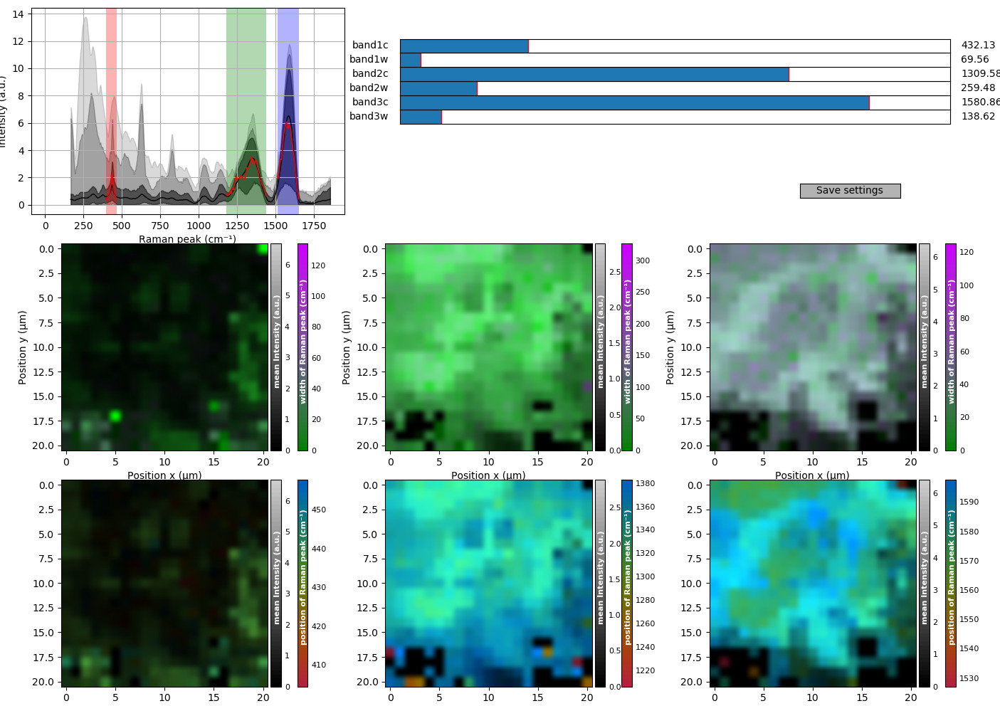

# FZU14_Raman_maps

## Installation

The dependencies of simple tool are Python 3.6+, Matplotlib and Numpy on any compatible operating system. 

Run something like 

    python FZU14_Raman_maps.py


## Use

Upon starting ```FZU14_Raman_maps.py```, you will be asked which *.txt file should be loaded. 

The format of this file is expected to be compatible with Horiba Labspec *export into text* feature. (I.e. the first line contains two tabs and then readable numbers for wavelengths. All following lines contain two coordinates first, followed by numbers corresponding to spectral intensity at given wavelength. All values are tab separated - basically it is a big CSV table.)

Once you are happy with the spectral band setup, it is advisable to click the [Save settings] button so that they are automatically pre-set if another spectral map is processed in the future. 

To export the graph, one can click the diskette icon in the bottom toolbar. For publication, PDF export and some post-processing in a vector editor like Inkscape are advisable. 




## What you see in the graph

For instance, by mapping an 24×24 μm square area with 2μm pitch, one gets 13×13 = 169 individual Raman spectra in the map.
The leftmost top graph presents an overview of these raw Raman spectra from the file. (Plotting 169 curves is inefficient, so, multiple spectra are aggregated into grey bands by quantiles: The light grey area contains 99.9% of all spectral points, the medium grey 99% and the dark grey 90% of them. The thick black line is simple average of all spectra, and short red curves are previews of the average spectrum in each selected band *after* background removal. )

In top right part of the window, there are six sliders, which allow the user to shift and stretch spectral regions of interest. These are also seen in the spectral graph as semi-transparent red, green and blue bands. 

Middle row shows the intensity of the spectral bands, along with their effective FWHM width. The intensity is encoded simply as brightness, the width is plotted in false colour with a custom isoluminant green-grey-pink colormap. Ignoring this colormap, the middle row of graphs is most useful for identifying the location of the material corresponding to the selected peak. 

Bottom rows show, again, the intensity encoded as brightness, but the rainbow isoluminant colormap corresponds to spectral position of the peak. 

In all six panels, the color mapping is auto-adjusted for the selected spectral range. 

Note that, although meticulously tuned to provide best possible results on realistic Raman spectra, sometimes the peak-finding algorithm does not correctly detect the peak. Such points are simply pitch black in the maps, even if there is some nonzero signal.


## Programmer tips

While this was intended as a quick-and-dirty tool to replace the not-user-friendly software from the Raman lab, it incorporates few non-trivial tricks that could be useful elsewhere:

* Isoluminant rainbow colormap (missing in matplotlib!)
* Isoluminant two-color mapping (dtto)
* Feature that multiplies these colormaps with brightness function to show two quantities in one 2-D image, and adds correct double colorbars. 
* The "parametrizer.py" module making it fairly easy to link the interactive sliders with plotting functions, along with automatic parameter saving/re-loading
* The "spectral_preprocessing.py" module that employs battle-tested mathematical operations for Raman analysis. In particular, I have developed an original iterative rubber-band background detection to extract peak information even if there is relatively strong fluorescence. 
* Auto-suggesting default export file name for Matplotlib interactive plot.


## Acknowledgements

(c) Filip Dominec 2022-2024

Licensed under MIT license terms

The development & testing of this application was performed at the Semiconductor department 14 of the FZU - Institute of Physics, Czech Academy of Sciences. 

Special thanks to Dr. Karla Kuldová and Robert Horešovský for providing data and valuable feedback. 

Feel free to add an "issue" on the github page with any questions or feature request.  
